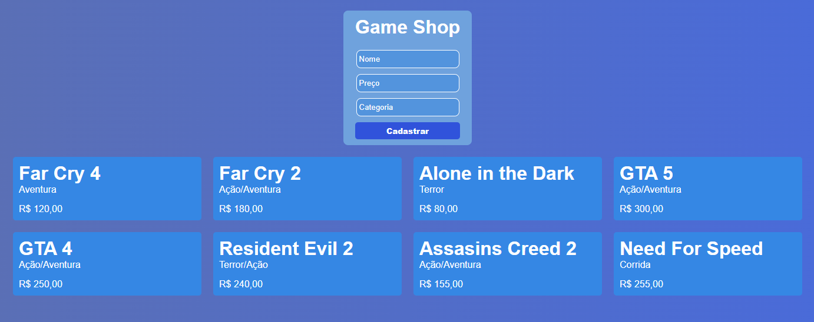

# Crud com React, Node JS e MySQL - Aula Youtube Vitor Cunha Code




Este é um projeto de estudo de React, Node.js e MySQL, criado com o objetivo de aprender os conceitos básicos dessas tecnologias e desenvolver habilidades na criação de aplicações full-stack.

Foi desenvolvido com os videos do canal **[Vitor Cunha Code](https://www.youtube.com/@VitorCunhaCode)**.

Video: **[Crud utilizando React Js, Node e MySQL](https://youtu.be/e0He6sCiQT8)**

## 📋 Requisitos

Para executar este projeto, você precisará ter o seguinte instalado em seu computador:

- Node.js
- MySQL

## 🚀 Criação do projeto

Crie a pasta react-crud para o projeto e abra a pasta com o VSCode.

Crie as pastas client e server.

Em seguida acesse a pasta client digite no terminal:

~~~cmd~~~
npx create-react-app .
~~~

Esse comando vai instalar as dependências do React no projeto. O ponto no final do comando indica que será feito o procedimento na pasta que está sendo executado o terminal.

## ou

Clone este repositório em sua máquina usando o seguinte comando:

~~~node
git clone https://github.com/gabrielsouzas/react-crud.git
~~~

## Rodar o projeto

~~~node
cd server
npm run dev
~~~

e

~~~node
cd client
npm start
~~~

5. Abra o seu navegador e acesse https://localhost:3000.


## 🖥️ Instalação das dependências

Para instalar as dependências do lado do servidor no projeto execute o comando abaixo na pasta server:

~~~node~~~
npm add mysql express cors nodemon axios dotenv
~~~

```node
npm install @mui/material @emotion/react @emotion/styled
```

Onde:

* MySQL: Banco de dados;
* Express: Servidor;
* Cors: Middleware de conexões entre servidores;
* Nodemon: Assistente que reinicia o servidor a cada alteração;
* Axios: Gerenciar as requisições;
* Dotenv: Carregar variáveis de ambiente;
* MUI/Material: Biblioteca React para criar o formulário de edição.

## 🛠️ Recursos e Tecnologias

Este projeto usa as seguintes tecnologias:

- 
- 
- 
- 

## 🤝 Contribuição

Se você deseja contribuir com este projeto, sinta-se à vontade para abrir uma Pull Request. 